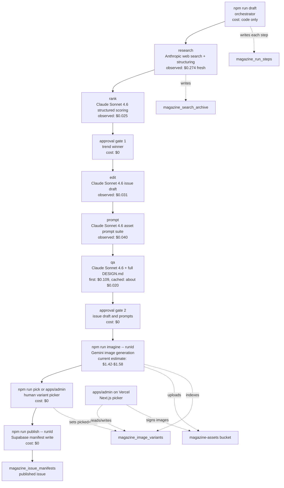

# the-edit Architecture, Costs, Prompts, and Deploy Notes

Last audited: 2026-05-07 on branch `feat/admin-app`.

## What this repo does

`the-edit` is the server-side Magazine Weekly pipeline for StyleMeUp. It researches a returning fashion trend, ranks candidates, writes a Magazine issue, creates asset prompts, QA-checks the issue, generates image variants, lets a human pick variants, and publishes a manifest to Supabase.

The product app is not in this repo. The sibling `../styleMeUp` repo supplies brand/design context through `DESIGN.md` and `AGENTS.md`.

## Architecture Diagram



## Cost Model By Step

| Step | Model/tool | Current cost logic | Verified or expected cost |
|---|---|---|---|
| `research/search` | Anthropic `claude-sonnet-4-6` with `web_search_20260209` | Input at $3/MTok, output at $15/MTok, cache write at 1.25x input, cache read at 0.1x input, plus $0.01 per search query. Tool is capped at `max_uses: 3`. | The successful 2026-05-04 run was $0.247 with 5 queries. Current cap should be lower on fresh trends. |
| `research/structure` | Claude via Vercel AI SDK `generateObject` | Same token rates, no web-search fee. | $0.027 observed. |
| `rank` | Claude via `generateObject` | Same token rates. | $0.025 observed. |
| `edit` | Claude via `generateObject` | Same token rates. Injects brand preamble plus DESIGN.md section 4 and headline rules. | $0.031 observed. |
| `prompt` | Claude via `generateObject` | Same token rates. Emits cover/card prompts and runs deterministic prompt validation before QA. | $0.040 observed. |
| `qa` | Claude via `generateObject` | Full DESIGN.md is cached. First cache write is more expensive; later reads are about 0.1x input cost. | $0.109 first run; about $0.020 after cache hits. |
| `approval` | Human stdin gate | No model call. | $0. |
| `imagine` | Gemini image generation | `cover-*`: `gemini-3-pro-image-preview` at $0.10/image. `trend-*` and `curator-*`: `gemini-2.5-flash-image` at $0.039/image. Default 4 variants per slot. | With 2 cover slots, 3 trend slots, and 1-2 curator slots: about $1.42-$1.58. Older docs saying $1.09 assumed all 28 images used Flash at $0.039. |
| `pick` | CLI Quick Look or Next admin app | Human selection, Supabase update only. | $0 plus normal Supabase/Vercel free-tier usage. |
| `publish` | TypeScript manifest assembler | No model call. Writes `magazine_issue_manifests`. | $0. |

Important cost note: the default hard cap is still `$2.00`. With Pro cover images enabled, a fresh full run can land near `$2.06` (`about $0.48` draft plus `about $1.58` imagine). Either raise `MAGAZINE_HARD_CAP_USD` slightly for full Pro-cover runs, or route covers back to the cheaper Flash image model to stay comfortably under $2.

## Prompt Surfaces

All editorial executors share the `BRAND_PREAMBLE` from `src/lib/context.ts`:

```text
You are producing content for StyleMeUp Magazine Weekly.
Register: Magazine only. Voice: editorial, declarative, present tense.
Never use: AI, magic, smart, intelligent, powered by, curated for you.
Never use: exclamation marks, emoji, passive voice, filler adjectives.
Every line must pass the Vogue test: could a Vogue editor have written this?
Banned copy and visuals are defined in DESIGN.md section 4. Treat them as hard constraints.
```

| Step | Prompt being used | Code |
|---|---|---|
| `research/search` | System: cached brand preamble plus first 3000 chars of `DESIGN.md`. User: date range, audience tracks, optional seed trend, prior issue slugs, "find exactly 3 fashion trends returning from a prior era", use no more than 5 total searches in copy while the tool itself caps at 3, cite factual claims, avoid login-walled content. | `src/executors/research.ts` |
| `research/structure` | User: convert research narrative into 3 trend candidates with era reference, current signal summary, confidence note, and source gaps. | `src/executors/research.ts` |
| `rank` | System: brand preamble. User: audience tracks, structured candidates, research notes, score each candidate on return signal, styling usefulness, visual feasibility, and brand fit, then select one winner with 3 distinct story angles. | `src/executors/rank.ts` |
| `edit` | System: brand preamble, DESIGN.md section 4 bans, and DESIGN.md section 5.5 headline rules. User: volume, winning trend, era reference, rationale, ranked story angles, then write the issue draft in Magazine voice. | `src/executors/edit.ts` |
| `prompt` | System: brand preamble plus asset rules: garment-first prompts, no humans in base prompt, no flat-lays/top-down views, no visible brands/logos, no anatomical close-ups, no tool names, strict black/off-white backgrounds, alt text must lead with physical descriptors. User: issue draft and trend cards, then generate cover, trend, and curator prompt suite. | `src/executors/prompt.ts` |
| `qa` | Cached content: brand preamble plus full `DESIGN.md`. Variable user content: issue draft, asset prompts, research sources, budget ceiling, and six checks: Vogue test, banned language, unsupported claims, asset compliance, accessibility, and budget. | `src/executors/qa.ts` |
| `imagine` | Takes the generated asset prompts and appends deterministic variant instructions: 3 garment-only product views, 1 lifestyle/model context shot per slot, aspect ratio, and global negative prompt. | `src/executors/imagine.ts` |
| `publish` | No LLM prompt. It assembles approved artifacts into `MagazineIssueManifest`. | `src/executors/publish.ts` |

## Last Two Iterations

By git history, the last two iterations are:

1. `cafed4d` on 2026-05-07: `feat(admin): Vercel Hobby admin app for variant picker`
   - Added `apps/admin`, a Next.js 15 App Router admin UI.
   - Added run list, per-run variant grid, server action to set `picked=true`, signed Supabase Storage image URLs, Basic Auth middleware, and Vercel deployment notes.
   - This replaces the local-only `npm run pick` workflow with a browser picker while keeping the CLI picker compatible.

2. `ef1ea1c` on 2026-05-06: `edit: enforce DESIGN.md section 5.5 headline patterns via Zod refines + system prompt`
   - Added deterministic headline checks to prevent textbook-style headlines.
   - Enforced short declarative headlines, no question/exclamation endings, no colons, and no question openers.
   - Taught the editor prompt four headline shapes: Reversal, Possessive, Date Stamp, and Single Verb.

The iteration immediately before those, `8ae83cf`, moved several QA failures earlier in the pipeline by adding prompt-suite validation for flat-lays, gradient/tinted backgrounds, asset tool-name leaks, brand names, anatomical close-ups, and weak alt text.

## Vercel Deployment Diagnosis

Current state from the Vercel CLI on 2026-05-07:

- CLI is logged in as `siddnyati96-5965`.
- Vercel project exists: `the-edit`.
- Latest production URL: `https://the-edit-lime.vercel.app`.
- Latest production deployment is marked `Ready`, but the live page returns `HTTP 404`.
- Build logs show Vercel cloned `github.com/siddarthnyati/the-edit` on branch `main` at commit `ef1ea1c`.
- Build logs show `Builds: . [0ms]`, meaning it built the repo root instead of the admin app.
- There is no local `.vercel/project.json`, so this working directory is not linked locally.

Root cause: Vercel is deploying `main` from the repo root, while the admin app exists on `feat/admin-app` under `apps/admin`.

Fix path:

1. Get the admin app onto the production branch, either by merging/pushing `feat/admin-app` to `main`, or by changing the Vercel production branch to `feat/admin-app`.
2. In Vercel Project Settings, set Root Directory to `apps/admin`.
3. Add production env vars before redeploy:
   - `NEXT_PUBLIC_SUPABASE_URL=https://bocvtwwmqphfnwmzdjcc.supabase.co`
   - `NEXT_PUBLIC_SUPABASE_ANON_KEY`
   - `SUPABASE_SERVICE_ROLE_KEY`
   - `ADMIN_USERNAME=admin`
   - `ADMIN_PASSWORD`
4. Redeploy. Expected unauthenticated result after the fix: `HTTP 401` with a Basic Auth challenge, not `HTTP 404`.

Useful CLI path after the dashboard project is corrected:

```bash
cd /Users/siddarthnyati/the-edit/apps/admin
npx vercel link --yes --project the-edit
npx vercel env pull .env.local
npm run build
npx vercel --prod
```

Local verification from this audit:

- `npm run typecheck` passes at repo root.
- `npm run typecheck` passes in `apps/admin`.
- `npm run build` in `apps/admin` fails if Supabase env vars are missing.
- `npm run build` in `apps/admin` passes when required env vars are present.

## Hiring Manager Mode File

`Hiring_manager_Mode.md` is not in this repo. The matching file is in the sibling repo:

```text
../styleMeUp/learning/HIRING_MANAGER_MODE.md
```

Current status there:

- It is untracked in `../styleMeUp`, so there is no git commit history for it yet.
- Filesystem last modified time: 2026-05-07 15:07:13 EDT.
- Content: five interview practice rounds for Anthropic, Meta, OpenAI, Stripe, and cross-cutting Senior PM interviews, plus a 0-10 scoring rubric and a template for asking Claude to score answers.
